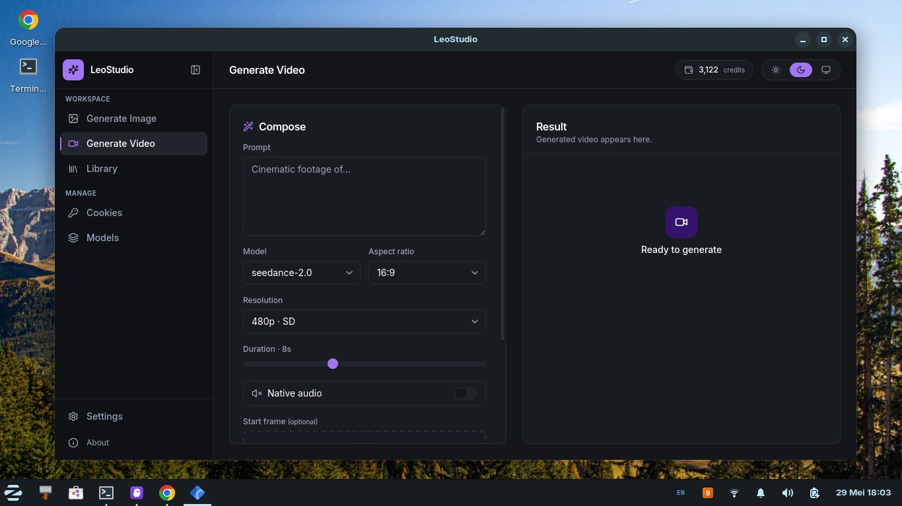

# LeoStudio

Desktop app for Leonardo AI image and video generation. Single binary, dark UI,
cookie-pool based auth so you can rotate multiple Leonardo accounts without
juggling API keys.

[](LICENSE)
[](https://github.com/hirotomasato/leostudio/releases/latest)
[](https://whatsapp.com/channel/0029VakVntuKgsNz5QgqU30C)

> Status: actively developed. Internal APIs may shift between minor versions.

<p align="center">
  
</p>

## UI overview

| Region | Purpose |
|---|---|
| Sidebar (Workspace) | Generate Image, Generate Video, Library |
| Sidebar (Manage) | Cookies (pool), Models (catalog + custom UUIDs) |
| Sidebar (footer) | Settings, About |
| Topbar | Page title, live credit pill (auto-refreshed after each generate), theme switcher |
| Compose panel | Prompt + per-model parameters (model, aspect ratio, resolution, duration, audio toggle, reference frames) |
| Result panel | Inline preview of the latest output, with replay-to-prompt and save-to-disk shortcuts |

## Features

| Area | What it does |
|---|---|
| Image generation | OpenAI-compatible flow against the official Leonardo catalog |
| Video generation | Seedance text-to-video and image-to-video |
| Cookie pool | Multi-account rotation with auto-disable on expiry / depleted balance |
| Auto-refresh balance | UI updates after every successful generate |
| Auto-save | Optional download of every output to a chosen folder |
| Drag and drop | Upload reference / start frame from local disk |
| Library | Searchable history with thumbnail preview, replay prompt |
| Native | Save dialog, folder picker, browser-open via Wails runtime |

## Architecture

```
desktop/                Wails entry point + React frontend (Vite + Tailwind)
internal/leonardo/      Leonardo HTTP / GraphQL client with TLS impersonation
internal/service/       Cookie pool, generate orchestration, model sync
internal/store/         SQLite persistence (cookies, models, logs, settings)
internal/desktop/       App bindings exposed to the JS frontend
internal/server/        Optional standalone HTTP API (cmd/server)
internal/config/        Env-driven configuration
cmd/server/             OpenAI-compatible HTTP server binary
```

The desktop binary (`desktop/`) and the standalone HTTP server (`cmd/server/`)
share every layer below. You can run either independently.

## Image models

The Leonardo image catalog is fetched live via GraphQL. Auto-sync runs on
first launch when the local model table is empty and at least one active
cookie is present. You can also trigger a sync manually from the Models tab.

The set of models updates over time and includes (as of 2026):

| sdVersion | Examples |
|---|---|
| Phoenix | Phoenix |
| Flux | FLUX Dev / FLUX Schnell / FLUX 1 Kontext / FLUX 2 Pro / FLUX Max |
| Lucid | Lucid Origin / Lucid Realism |
| GPT image | GPT Image 1.5 / GPT Image 2 |
| Nano banana | Nano Banana / Nano Banana Pro / Nano Banana 2 |
| Seedream | Seedream 4.0 / Seedream 4.5 |
| Ideogram | Ideogram 3.0 |
| Gemini image | Gemini Image 2 / Gemini 2.5 Flash |
| Recraft | Recraft V4 / Recraft V4 Pro |
| SDXL | SDXL 0.9 / SDXL Lightning |

Custom UUIDs can also be added by hand from the Models tab.

## Video models

Video models use a static catalog defined in `internal/service/video_models.go`
because Leonardo treats them as a fixed enum (not a `custom_models` row).

Currently shipped:

| Slug | Resolutions | Duration | Audio | Reference |
|---|---|---|---|---|
| seedance-2.0 | 480p / 720p / 1080p | 4–15 s | yes | start_frame, end_frame, image_reference |
| seedance-2.0-fast | 480p / 720p / 1080p | 4–15 s | yes | same |

Planned: Veo 3 / 3.1, Kling 2.5 Turbo / 3.0, Hailuo 2.3, LTX 2.x.

## Quick start

### Prerequisites

- Go 1.22+
- Node 20+ (and npm)
- Wails CLI (`go install github.com/wailsapp/wails/v2/cmd/wails@latest`)
- Linux: `libgtk-3-dev` and `libwebkit2gtk-4.1-dev` (or 4.0 if you prefer)

### Develop

```bash
cd desktop
wails dev -tags webkit2_41   # Linux with webkit 4.1
wails dev                    # macOS / Windows / Linux with webkit 4.0
```

### Production build

```bash
cd desktop
wails build -tags webkit2_41 -ldflags "-w -s"
```

Outputs:

- Linux: `desktop/build/bin/leostudio-desktop` (~21 MB)
- macOS: `desktop/build/bin/leostudio-desktop.app`
- Windows: `desktop/build/bin/leostudio-desktop.exe`

### Running the optional HTTP server

```bash
go run -tags webkit2_41 ./cmd/server
```

Defaults to `127.0.0.1:8000`. Same endpoints as the legacy LeoAPI:

```
GET  /health
POST /v1/images/generations
POST /v1/videos/generations
```

## Cookie setup

1. Get the ExLeo browser extension from the [WhatsApp channel](https://whatsapp.com/channel/0029VakVntuKgsNz5QgqU30C).
   The latest build is pinned in the channel description, along with install
   instructions for Chrome / Edge / Brave.
2. Open Leonardo AI in your browser, log in, then click the ExLeo icon to
   copy the full cookie string to your clipboard.
3. In LeoStudio, open the **Cookies** tab and paste it. The format is:

```
cookie=__Secure-better-auth.session_data.0=...; ...
token=eyJ...   (optional fallback bearer)
```

4. The backend validates the cookie against Leonardo and stores it only if
   it resolves to a usable JWT. Balance and email are populated automatically.
5. From this point on, every generate request rotates through active cookies
   and auto-disables ones that expire or run out of credit.

> Tip: paste cookies from multiple Leonardo accounts to build a rotation pool.
> LeoStudio picks the next active cookie automatically and skips depleted ones.

## Data location

By default the SQLite database lives at:

| OS | Path |
|---|---|
| Linux / macOS | `~/.config/leostudio/app.db` |
| Windows | `%APPDATA%\\leostudio\\app.db` |

Override with `LEOSTUDIO_DATA_DIR=/some/path`.

## Tech stack

- **Backend**: Go, Wails v2, modernc.org/sqlite (no CGO), imroc/req for TLS
  impersonation against Leonardo's Vercel checkpoint.
- **Frontend**: React 18, Vite 5, TypeScript, Tailwind 3, lucide-react icons,
  shadcn/ui inspired primitives.

## Community

Get release announcements, model updates, and tips on the official channel:

[](https://whatsapp.com/channel/0029VakVntuKgsNz5QgqU30C)

## License

[MIT](LICENSE) © hirotomasato

## Author

[hirotomasato](https://github.com/hirotomasato)
